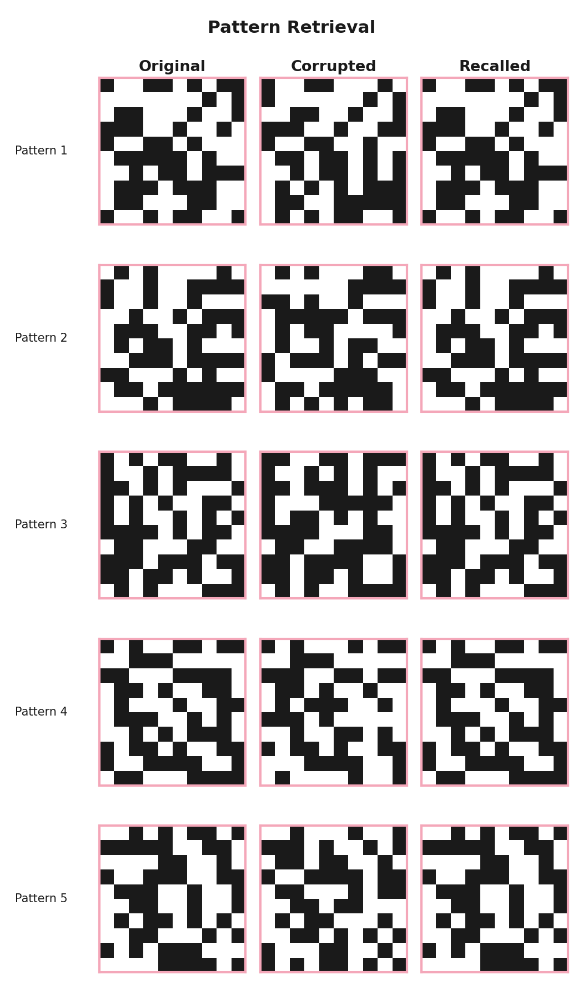
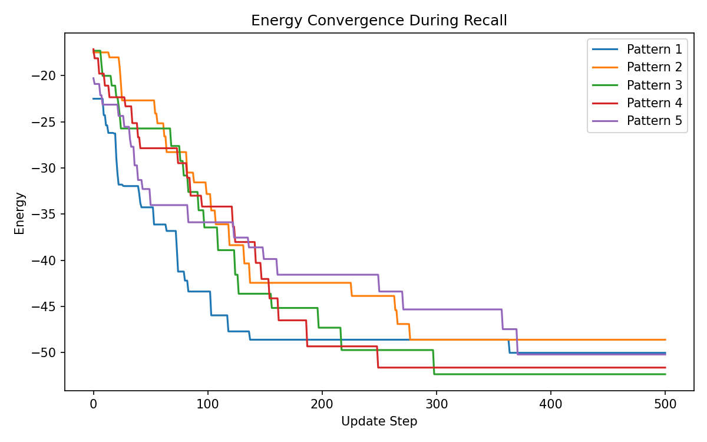
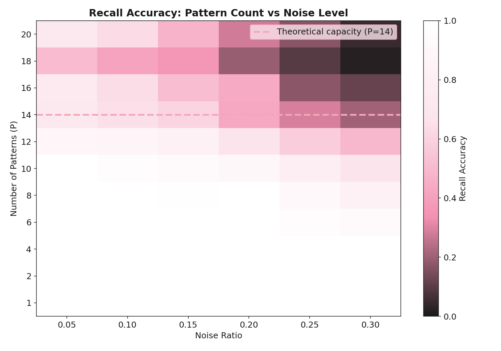

# Hopfield Network Memory Model

A Python implementation of a Hopfield Network — a recurrent neural network that stores memories as energy minima and retrieves them from noisy or partial inputs.

## What is a Hopfield Network?

A Hopfield Network stores binary patterns as stable states in a fully connected network. When given a corrupted version of a stored pattern, the network updates its neurons iteratively until it converges to the nearest stored memory. This is called **associative** or **content-addressable memory** — you retrieve a memory by providing a partial cue, not an exact address.

The network has a theoretical memory capacity of approximately **0.138 × N** patterns for N neurons. Beyond this limit, retrieval accuracy drops sharply as spurious attractors multiply.

## Install

```bash
git clone https://github.com/yourusername/hopfield-network.git
cd hopfield-network
python3.11 -m venv .venv
source .venv/bin/activate
pip install -e .
```

## Quick Start

```python
import numpy as np
from hopfield.network import HopfieldNetwork
from hopfield.patterns import random_pattern, add_noise, pattern_overlap

rng = np.random.default_rng(42)
net = HopfieldNetwork(100)

# Store 5 patterns
patterns = np.array([random_pattern(100, rng) for _ in range(5)])
net.train(patterns)

# Corrupt a pattern and retrieve it
probe = add_noise(patterns[0], noise_ratio=0.20, rng=rng)
recalled = net.recall(probe, max_steps=500, rng=rng)

print(f"Overlap with original: {pattern_overlap(recalled, patterns[0]):.3f}")
# Expected: >= 0.95
```

## Run the Demo Notebook

```bash
pip install jupyter
jupyter notebook demo.ipynb
```

## Run the Tests

```bash
pytest tests/ -v
```

With coverage:

```bash
pytest tests/ --cov=hopfield --cov-report=term-missing
```

## Figures

### Retrieval Grid
Original patterns (left), corrupted probes at 20% noise (middle), and recalled patterns (right).



### Energy Convergence
Energy decreases monotonically at every async update step, proving convergence to a stable attractor.



### Capacity Heatmap
Recall accuracy across pattern count (P) and noise level. The blue dashed line marks the theoretical capacity limit P ≈ 0.138N = 13 for N=100.



## Capacity Limits

The network stores patterns reliably up to P ≈ 0.138 × N (McEliece, 1987). For N=100 neurons this is ~13 patterns. Beyond this limit retrieval accuracy drops sharply because spurious attractors — stable states that don't correspond to any stored pattern — begin to dominate.

## Known Limitations

- Binary (bipolar) patterns only — no continuous-valued inputs
- Capacity scales linearly with N, not exponentially
- Spurious attractors appear near and above the capacity limit
- Synchronous updates are not implemented — async updates only

## Project Structure
src/hopfield/
network.py      — HopfieldNetwork class
patterns.py     — Pattern generation, noise, overlap
analysis.py     — Capacity sweep and accuracy metrics
visualize.py    — All figure generation
tests/
test_network.py
test_patterns.py
figures/
retrieval_grid.png
convergence.png
capacity_heatmap.png
demo.ipynb          — End-to-end demo notebook

## References

- Hopfield, J.J. (1982). Neural networks and physical systems with emergent collective computational abilities. *PNAS*, 79(8), 2554–2558.
- McEliece, R.J. et al. (1987). The capacity of the Hopfield associative memory. *IEEE Transactions on Information Theory*, 33(4), 461–482.